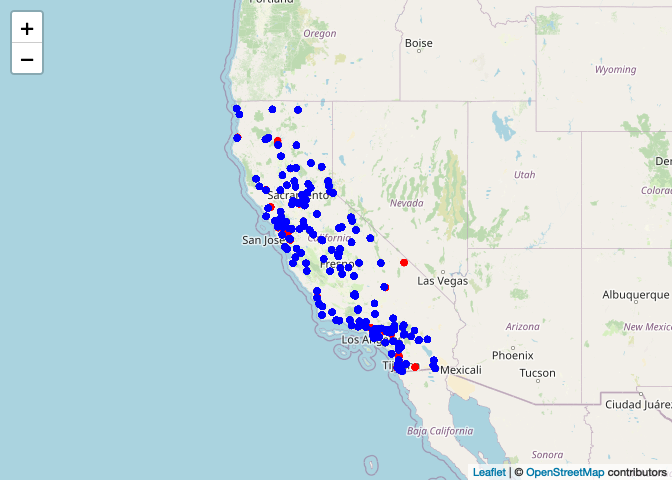

566-hw1
================
Yumeng Gao
2022-09-23

> The primary question: whether daily concentrations of PM (particulate
> matter air pollution 5.2 with aerodynamic diameter less than 2.5 m)
> have decreased in California over the last 15 years (from 2004 to
> 2019)

### Prepare the library

``` r
library(dplyr)
```

    ## 
    ## Attaching package: 'dplyr'

    ## The following objects are masked from 'package:stats':
    ## 
    ##     filter, lag

    ## The following objects are masked from 'package:base':
    ## 
    ##     intersect, setdiff, setequal, union

``` r
library(tidyverse)
```

    ## ── Attaching packages
    ## ───────────────────────────────────────
    ## tidyverse 1.3.2 ──

    ## ✔ ggplot2 3.3.6     ✔ purrr   0.3.4
    ## ✔ tibble  3.1.8     ✔ stringr 1.4.0
    ## ✔ tidyr   1.2.0     ✔ forcats 0.5.1
    ## ✔ readr   2.1.2     
    ## ── Conflicts ────────────────────────────────────────── tidyverse_conflicts() ──
    ## ✖ dplyr::filter() masks stats::filter()
    ## ✖ dplyr::lag()    masks stats::lag()

``` r
library(data.table)
```

    ## 
    ## Attaching package: 'data.table'
    ## 
    ## The following object is masked from 'package:purrr':
    ## 
    ##     transpose
    ## 
    ## The following objects are masked from 'package:dplyr':
    ## 
    ##     between, first, last

``` r
library(R.utils)
```

    ## Loading required package: R.oo
    ## Loading required package: R.methodsS3
    ## R.methodsS3 v1.8.2 (2022-06-13 22:00:14 UTC) successfully loaded. See ?R.methodsS3 for help.
    ## R.oo v1.25.0 (2022-06-12 02:20:02 UTC) successfully loaded. See ?R.oo for help.
    ## 
    ## Attaching package: 'R.oo'
    ## 
    ## The following object is masked from 'package:R.methodsS3':
    ## 
    ##     throw
    ## 
    ## The following objects are masked from 'package:methods':
    ## 
    ##     getClasses, getMethods
    ## 
    ## The following objects are masked from 'package:base':
    ## 
    ##     attach, detach, load, save
    ## 
    ## R.utils v2.12.0 (2022-06-28 03:20:05 UTC) successfully loaded. See ?R.utils for help.
    ## 
    ## Attaching package: 'R.utils'
    ## 
    ## The following object is masked from 'package:tidyr':
    ## 
    ##     extract
    ## 
    ## The following object is masked from 'package:utils':
    ## 
    ##     timestamp
    ## 
    ## The following objects are masked from 'package:base':
    ## 
    ##     cat, commandArgs, getOption, isOpen, nullfile, parse, warnings

``` r
library(lubridate)
```

    ## 
    ## Attaching package: 'lubridate'
    ## 
    ## The following objects are masked from 'package:data.table':
    ## 
    ##     hour, isoweek, mday, minute, month, quarter, second, wday, week,
    ##     yday, year
    ## 
    ## The following objects are masked from 'package:base':
    ## 
    ##     date, intersect, setdiff, union

``` r
library(leaflet)
library(webshot)
webshot::install_phantomjs()
```

    ## It seems that the version of `phantomjs` installed is greater than or equal to the requested version.To install the requested version or downgrade to another version, use `force = TRUE`.

## Step1. Conduct EDA Checklist items 2-4.

Download then read in the data

``` r
d04 <- data.table::fread("/Users/gao/Desktop/566 hw1/data_2004.csv")
d19 <- data.table::fread("/Users/gao/Desktop/566 hw1/data_2019.csv")
```

For each of the two datasets, check the dimensions, headers, footers,
variable names and variable types.

``` r
dim(d04)
```

    ## [1] 19233    20

``` r
head(d04)
```

    ##          Date Source  Site ID POC Daily Mean PM2.5 Concentration    UNITS
    ## 1: 01/01/2004    AQS 60010007   1                           11.0 ug/m3 LC
    ## 2: 01/02/2004    AQS 60010007   1                           12.2 ug/m3 LC
    ## 3: 01/03/2004    AQS 60010007   1                           16.5 ug/m3 LC
    ## 4: 01/04/2004    AQS 60010007   1                           19.5 ug/m3 LC
    ## 5: 01/05/2004    AQS 60010007   1                           11.5 ug/m3 LC
    ## 6: 01/06/2004    AQS 60010007   1                           32.5 ug/m3 LC
    ##    DAILY_AQI_VALUE Site Name DAILY_OBS_COUNT PERCENT_COMPLETE
    ## 1:              46 Livermore               1              100
    ## 2:              51 Livermore               1              100
    ## 3:              60 Livermore               1              100
    ## 4:              67 Livermore               1              100
    ## 5:              48 Livermore               1              100
    ## 6:              94 Livermore               1              100
    ##    AQS_PARAMETER_CODE                     AQS_PARAMETER_DESC CBSA_CODE
    ## 1:              88502 Acceptable PM2.5 AQI & Speciation Mass     41860
    ## 2:              88502 Acceptable PM2.5 AQI & Speciation Mass     41860
    ## 3:              88502 Acceptable PM2.5 AQI & Speciation Mass     41860
    ## 4:              88502 Acceptable PM2.5 AQI & Speciation Mass     41860
    ## 5:              88502 Acceptable PM2.5 AQI & Speciation Mass     41860
    ## 6:              88502 Acceptable PM2.5 AQI & Speciation Mass     41860
    ##                            CBSA_NAME STATE_CODE      STATE COUNTY_CODE  COUNTY
    ## 1: San Francisco-Oakland-Hayward, CA          6 California           1 Alameda
    ## 2: San Francisco-Oakland-Hayward, CA          6 California           1 Alameda
    ## 3: San Francisco-Oakland-Hayward, CA          6 California           1 Alameda
    ## 4: San Francisco-Oakland-Hayward, CA          6 California           1 Alameda
    ## 5: San Francisco-Oakland-Hayward, CA          6 California           1 Alameda
    ## 6: San Francisco-Oakland-Hayward, CA          6 California           1 Alameda
    ##    SITE_LATITUDE SITE_LONGITUDE
    ## 1:      37.68753      -121.7842
    ## 2:      37.68753      -121.7842
    ## 3:      37.68753      -121.7842
    ## 4:      37.68753      -121.7842
    ## 5:      37.68753      -121.7842
    ## 6:      37.68753      -121.7842

``` r
tail(d04)
```

    ##          Date Source  Site ID POC Daily Mean PM2.5 Concentration    UNITS
    ## 1: 12/14/2004    AQS 61131003   1                             11 ug/m3 LC
    ## 2: 12/17/2004    AQS 61131003   1                             16 ug/m3 LC
    ## 3: 12/20/2004    AQS 61131003   1                             17 ug/m3 LC
    ## 4: 12/23/2004    AQS 61131003   1                              9 ug/m3 LC
    ## 5: 12/26/2004    AQS 61131003   1                             24 ug/m3 LC
    ## 6: 12/29/2004    AQS 61131003   1                              9 ug/m3 LC
    ##    DAILY_AQI_VALUE            Site Name DAILY_OBS_COUNT PERCENT_COMPLETE
    ## 1:              46 Woodland-Gibson Road               1              100
    ## 2:              59 Woodland-Gibson Road               1              100
    ## 3:              61 Woodland-Gibson Road               1              100
    ## 4:              38 Woodland-Gibson Road               1              100
    ## 5:              76 Woodland-Gibson Road               1              100
    ## 6:              38 Woodland-Gibson Road               1              100
    ##    AQS_PARAMETER_CODE       AQS_PARAMETER_DESC CBSA_CODE
    ## 1:              88101 PM2.5 - Local Conditions     40900
    ## 2:              88101 PM2.5 - Local Conditions     40900
    ## 3:              88101 PM2.5 - Local Conditions     40900
    ## 4:              88101 PM2.5 - Local Conditions     40900
    ## 5:              88101 PM2.5 - Local Conditions     40900
    ## 6:              88101 PM2.5 - Local Conditions     40900
    ##                                  CBSA_NAME STATE_CODE      STATE COUNTY_CODE
    ## 1: Sacramento--Roseville--Arden-Arcade, CA          6 California         113
    ## 2: Sacramento--Roseville--Arden-Arcade, CA          6 California         113
    ## 3: Sacramento--Roseville--Arden-Arcade, CA          6 California         113
    ## 4: Sacramento--Roseville--Arden-Arcade, CA          6 California         113
    ## 5: Sacramento--Roseville--Arden-Arcade, CA          6 California         113
    ## 6: Sacramento--Roseville--Arden-Arcade, CA          6 California         113
    ##    COUNTY SITE_LATITUDE SITE_LONGITUDE
    ## 1:   Yolo      38.66121      -121.7327
    ## 2:   Yolo      38.66121      -121.7327
    ## 3:   Yolo      38.66121      -121.7327
    ## 4:   Yolo      38.66121      -121.7327
    ## 5:   Yolo      38.66121      -121.7327
    ## 6:   Yolo      38.66121      -121.7327

``` r
str(d04)
```

    ## Classes 'data.table' and 'data.frame':   19233 obs. of  20 variables:
    ##  $ Date                          : chr  "01/01/2004" "01/02/2004" "01/03/2004" "01/04/2004" ...
    ##  $ Source                        : chr  "AQS" "AQS" "AQS" "AQS" ...
    ##  $ Site ID                       : int  60010007 60010007 60010007 60010007 60010007 60010007 60010007 60010007 60010007 60010007 ...
    ##  $ POC                           : int  1 1 1 1 1 1 1 1 1 1 ...
    ##  $ Daily Mean PM2.5 Concentration: num  11 12.2 16.5 19.5 11.5 32.5 14 29.9 21 15.7 ...
    ##  $ UNITS                         : chr  "ug/m3 LC" "ug/m3 LC" "ug/m3 LC" "ug/m3 LC" ...
    ##  $ DAILY_AQI_VALUE               : int  46 51 60 67 48 94 55 88 70 59 ...
    ##  $ Site Name                     : chr  "Livermore" "Livermore" "Livermore" "Livermore" ...
    ##  $ DAILY_OBS_COUNT               : int  1 1 1 1 1 1 1 1 1 1 ...
    ##  $ PERCENT_COMPLETE              : num  100 100 100 100 100 100 100 100 100 100 ...
    ##  $ AQS_PARAMETER_CODE            : int  88502 88502 88502 88502 88502 88502 88101 88502 88502 88101 ...
    ##  $ AQS_PARAMETER_DESC            : chr  "Acceptable PM2.5 AQI & Speciation Mass" "Acceptable PM2.5 AQI & Speciation Mass" "Acceptable PM2.5 AQI & Speciation Mass" "Acceptable PM2.5 AQI & Speciation Mass" ...
    ##  $ CBSA_CODE                     : int  41860 41860 41860 41860 41860 41860 41860 41860 41860 41860 ...
    ##  $ CBSA_NAME                     : chr  "San Francisco-Oakland-Hayward, CA" "San Francisco-Oakland-Hayward, CA" "San Francisco-Oakland-Hayward, CA" "San Francisco-Oakland-Hayward, CA" ...
    ##  $ STATE_CODE                    : int  6 6 6 6 6 6 6 6 6 6 ...
    ##  $ STATE                         : chr  "California" "California" "California" "California" ...
    ##  $ COUNTY_CODE                   : int  1 1 1 1 1 1 1 1 1 1 ...
    ##  $ COUNTY                        : chr  "Alameda" "Alameda" "Alameda" "Alameda" ...
    ##  $ SITE_LATITUDE                 : num  37.7 37.7 37.7 37.7 37.7 ...
    ##  $ SITE_LONGITUDE                : num  -122 -122 -122 -122 -122 ...
    ##  - attr(*, ".internal.selfref")=<externalptr>

``` r
dim(d19)
```

    ## [1] 53156    20

``` r
head(d19)
```

    ##          Date Source  Site ID POC Daily Mean PM2.5 Concentration    UNITS
    ## 1: 01/01/2019    AQS 60010007   3                            5.7 ug/m3 LC
    ## 2: 01/02/2019    AQS 60010007   3                           11.9 ug/m3 LC
    ## 3: 01/03/2019    AQS 60010007   3                           20.1 ug/m3 LC
    ## 4: 01/04/2019    AQS 60010007   3                           28.8 ug/m3 LC
    ## 5: 01/05/2019    AQS 60010007   3                           11.2 ug/m3 LC
    ## 6: 01/06/2019    AQS 60010007   3                            2.7 ug/m3 LC
    ##    DAILY_AQI_VALUE Site Name DAILY_OBS_COUNT PERCENT_COMPLETE
    ## 1:              24 Livermore               1              100
    ## 2:              50 Livermore               1              100
    ## 3:              68 Livermore               1              100
    ## 4:              86 Livermore               1              100
    ## 5:              47 Livermore               1              100
    ## 6:              11 Livermore               1              100
    ##    AQS_PARAMETER_CODE       AQS_PARAMETER_DESC CBSA_CODE
    ## 1:              88101 PM2.5 - Local Conditions     41860
    ## 2:              88101 PM2.5 - Local Conditions     41860
    ## 3:              88101 PM2.5 - Local Conditions     41860
    ## 4:              88101 PM2.5 - Local Conditions     41860
    ## 5:              88101 PM2.5 - Local Conditions     41860
    ## 6:              88101 PM2.5 - Local Conditions     41860
    ##                            CBSA_NAME STATE_CODE      STATE COUNTY_CODE  COUNTY
    ## 1: San Francisco-Oakland-Hayward, CA          6 California           1 Alameda
    ## 2: San Francisco-Oakland-Hayward, CA          6 California           1 Alameda
    ## 3: San Francisco-Oakland-Hayward, CA          6 California           1 Alameda
    ## 4: San Francisco-Oakland-Hayward, CA          6 California           1 Alameda
    ## 5: San Francisco-Oakland-Hayward, CA          6 California           1 Alameda
    ## 6: San Francisco-Oakland-Hayward, CA          6 California           1 Alameda
    ##    SITE_LATITUDE SITE_LONGITUDE
    ## 1:      37.68753      -121.7842
    ## 2:      37.68753      -121.7842
    ## 3:      37.68753      -121.7842
    ## 4:      37.68753      -121.7842
    ## 5:      37.68753      -121.7842
    ## 6:      37.68753      -121.7842

``` r
tail(d19)
```

    ##          Date Source  Site ID POC Daily Mean PM2.5 Concentration    UNITS
    ## 1: 11/11/2019    AQS 61131003   1                           13.5 ug/m3 LC
    ## 2: 11/17/2019    AQS 61131003   1                           18.1 ug/m3 LC
    ## 3: 11/29/2019    AQS 61131003   1                           12.5 ug/m3 LC
    ## 4: 12/17/2019    AQS 61131003   1                           23.8 ug/m3 LC
    ## 5: 12/23/2019    AQS 61131003   1                            1.0 ug/m3 LC
    ## 6: 12/29/2019    AQS 61131003   1                            9.1 ug/m3 LC
    ##    DAILY_AQI_VALUE            Site Name DAILY_OBS_COUNT PERCENT_COMPLETE
    ## 1:              54 Woodland-Gibson Road               1              100
    ## 2:              64 Woodland-Gibson Road               1              100
    ## 3:              52 Woodland-Gibson Road               1              100
    ## 4:              76 Woodland-Gibson Road               1              100
    ## 5:               4 Woodland-Gibson Road               1              100
    ## 6:              38 Woodland-Gibson Road               1              100
    ##    AQS_PARAMETER_CODE       AQS_PARAMETER_DESC CBSA_CODE
    ## 1:              88101 PM2.5 - Local Conditions     40900
    ## 2:              88101 PM2.5 - Local Conditions     40900
    ## 3:              88101 PM2.5 - Local Conditions     40900
    ## 4:              88101 PM2.5 - Local Conditions     40900
    ## 5:              88101 PM2.5 - Local Conditions     40900
    ## 6:              88101 PM2.5 - Local Conditions     40900
    ##                                  CBSA_NAME STATE_CODE      STATE COUNTY_CODE
    ## 1: Sacramento--Roseville--Arden-Arcade, CA          6 California         113
    ## 2: Sacramento--Roseville--Arden-Arcade, CA          6 California         113
    ## 3: Sacramento--Roseville--Arden-Arcade, CA          6 California         113
    ## 4: Sacramento--Roseville--Arden-Arcade, CA          6 California         113
    ## 5: Sacramento--Roseville--Arden-Arcade, CA          6 California         113
    ## 6: Sacramento--Roseville--Arden-Arcade, CA          6 California         113
    ##    COUNTY SITE_LATITUDE SITE_LONGITUDE
    ## 1:   Yolo      38.66121      -121.7327
    ## 2:   Yolo      38.66121      -121.7327
    ## 3:   Yolo      38.66121      -121.7327
    ## 4:   Yolo      38.66121      -121.7327
    ## 5:   Yolo      38.66121      -121.7327
    ## 6:   Yolo      38.66121      -121.7327

``` r
str(d19)
```

    ## Classes 'data.table' and 'data.frame':   53156 obs. of  20 variables:
    ##  $ Date                          : chr  "01/01/2019" "01/02/2019" "01/03/2019" "01/04/2019" ...
    ##  $ Source                        : chr  "AQS" "AQS" "AQS" "AQS" ...
    ##  $ Site ID                       : int  60010007 60010007 60010007 60010007 60010007 60010007 60010007 60010007 60010007 60010007 ...
    ##  $ POC                           : int  3 3 3 3 3 3 3 3 3 3 ...
    ##  $ Daily Mean PM2.5 Concentration: num  5.7 11.9 20.1 28.8 11.2 2.7 2.8 7 3.1 7.1 ...
    ##  $ UNITS                         : chr  "ug/m3 LC" "ug/m3 LC" "ug/m3 LC" "ug/m3 LC" ...
    ##  $ DAILY_AQI_VALUE               : int  24 50 68 86 47 11 12 29 13 30 ...
    ##  $ Site Name                     : chr  "Livermore" "Livermore" "Livermore" "Livermore" ...
    ##  $ DAILY_OBS_COUNT               : int  1 1 1 1 1 1 1 1 1 1 ...
    ##  $ PERCENT_COMPLETE              : num  100 100 100 100 100 100 100 100 100 100 ...
    ##  $ AQS_PARAMETER_CODE            : int  88101 88101 88101 88101 88101 88101 88101 88101 88101 88101 ...
    ##  $ AQS_PARAMETER_DESC            : chr  "PM2.5 - Local Conditions" "PM2.5 - Local Conditions" "PM2.5 - Local Conditions" "PM2.5 - Local Conditions" ...
    ##  $ CBSA_CODE                     : int  41860 41860 41860 41860 41860 41860 41860 41860 41860 41860 ...
    ##  $ CBSA_NAME                     : chr  "San Francisco-Oakland-Hayward, CA" "San Francisco-Oakland-Hayward, CA" "San Francisco-Oakland-Hayward, CA" "San Francisco-Oakland-Hayward, CA" ...
    ##  $ STATE_CODE                    : int  6 6 6 6 6 6 6 6 6 6 ...
    ##  $ STATE                         : chr  "California" "California" "California" "California" ...
    ##  $ COUNTY_CODE                   : int  1 1 1 1 1 1 1 1 1 1 ...
    ##  $ COUNTY                        : chr  "Alameda" "Alameda" "Alameda" "Alameda" ...
    ##  $ SITE_LATITUDE                 : num  37.7 37.7 37.7 37.7 37.7 ...
    ##  $ SITE_LONGITUDE                : num  -122 -122 -122 -122 -122 ...
    ##  - attr(*, ".internal.selfref")=<externalptr>

Check for any data issues, particularly in the key variable we are
analyzing.

``` r
summary(d04$`Daily Mean PM2.5 Concentration`)
```

    ##    Min. 1st Qu.  Median    Mean 3rd Qu.    Max. 
    ##   -0.10    6.00   10.10   13.13   16.30  251.00

``` r
table(d04$STATE)
```

    ## 
    ## California 
    ##      19233

``` r
table(d04$COUNTY)
```

    ## 
    ##         Alameda           Butte       Calaveras          Colusa    Contra Costa 
    ##             458             444              61             201             259 
    ##       Del Norte       El Dorado          Fresno        Humboldt        Imperial 
    ##             117             128             811              58             366 
    ##            Inyo            Kern           Kings            Lake     Los Angeles 
    ##             247            1304              84              60            2243 
    ##           Marin        Mariposa       Mendocino          Merced            Mono 
    ##             120             320              61              90             181 
    ##        Monterey          Nevada          Orange          Placer          Plumas 
    ##              60             232             529             246             258 
    ##       Riverside      Sacramento      San Benito  San Bernardino       San Diego 
    ##            1203            1453             122             893            1431 
    ##   San Francisco     San Joaquin San Luis Obispo       San Mateo   Santa Barbara 
    ##             560             122             176             354             225 
    ##     Santa Clara      Santa Cruz          Shasta        Siskiyou          Solano 
    ##             660              56             181             117             361 
    ##          Sonoma      Stanislaus          Sutter         Trinity          Tulare 
    ##              92             183             309             115             627 
    ##         Ventura            Yolo 
    ##             580             475

``` r
table(d04$`Site Name`)
```

    ## 
    ##                                                   
    ##                                               229 
    ##                           3425 N FIRST ST, FRESNO 
    ##                                               521 
    ##                                           Anaheim 
    ##                                               418 
    ##                             Aqua Tibia Wilderness 
    ##                                               109 
    ##                        Atascadero (original site) 
    ##                                               117 
    ##                                             Azusa 
    ##                                               279 
    ##                       Bakersfield-Airport (Planz) 
    ##                                               100 
    ##                            Bakersfield-California 
    ##                                               850 
    ##                         Bakersfield-Golden / M St 
    ##                                                88 
    ##                                          Big Bear 
    ##                                                52 
    ##                                          Bliss SP 
    ##                                               119 
    ##                           Brawley-220 Main Street 
    ##                                                99 
    ##                                           Burbank 
    ##                                               109 
    ##                             Calexico-Ethel Street 
    ##                                               162 
    ##                              Chico-Manzanita Ave. 
    ##                                               122 
    ##                                       Chula Vista 
    ##                                               113 
    ##                                      Clovis-Villa 
    ##                                                90 
    ##                               Colusa-Sunrise Blvd 
    ##                                               201 
    ##                                           Concord 
    ##                                               259 
    ##                                Corcoran-Patterson 
    ##                                                84 
    ##                                  Davis-UCD Campus 
    ##                                               359 
    ##                    Death Valley NP - Park Village 
    ##                                               119 
    ##                                          El Cajon 
    ##                                               438 
    ##                              El Centro-9th Street 
    ##                                               105 
    ##                         El Rio-Rio Mesa School #2 
    ##                                               117 
    ##                                         Escondido 
    ##                                               412 
    ##                                   Eureka I Street 
    ##                                                58 
    ##                                           Fontana 
    ##                                               199 
    ##                              Fremont - Chapel Way 
    ##                                                94 
    ##                                    Fresno-Pacific 
    ##                                                90 
    ##                      Grass Valley-Litton Building 
    ##                                                56 
    ##                                 Hoover Wilderness 
    ##                                               122 
    ##                                             Indio 
    ##                                               161 
    ##                       Joshua Tree NP - Black Rock 
    ##                                               121 
    ##                                 Kaiser Wilderness 
    ##                                               110 
    ##                                       Kearny Mesa 
    ##                                               108 
    ##                                            Keeler 
    ##                                               128 
    ##                              La Posta Reservation 
    ##                                                23 
    ##                           Lakeport-Lakeport Blvd. 
    ##                                                60 
    ##                         Lancaster-Division Street 
    ##                                               111 
    ##  Lassen Volcanic NP - Manzanita Lake Fire Station 
    ##                                               110 
    ##                       Lava Beds National Monument 
    ##                                               117 
    ##                                             Lebec 
    ##                                               115 
    ##                           Lebec-Peace Valley Road 
    ##                                               107 
    ##                                         Livermore 
    ##                                               364 
    ##                                Long Beach (North) 
    ##                                               325 
    ##                                Long Beach (South) 
    ##                                               327 
    ##                     Los Angeles-North Main Street 
    ##                                               535 
    ##                                           Lynwood 
    ##                                               115 
    ##                                           Mammoth 
    ##                                                59 
    ##                                       Merced-M St 
    ##                                                90 
    ##                                     Mission Viejo 
    ##                                               111 
    ##                               Modesto-14th Street 
    ##                                               183 
    ##                                            Mojave 
    ##                                                63 
    ##                              Ontario Fire Station 
    ##                                               112 
    ##                                      Palm Springs 
    ##                                               112 
    ##                                          Pasadena 
    ##                                               113 
    ## Pinnacles NP - Southwest of East Entrance Station 
    ##                                               122 
    ##                                    Piru - Pacific 
    ##                                               111 
    ##                     Point Reyes NS Ranger Station 
    ##                                               120 
    ##                         Portola-161 Nevada Street 
    ##                                               181 
    ##                            Quincy-N Church Street 
    ##                                                77 
    ##                                 Redding - Buckeye 
    ##                                                 6 
    ##                       Redding - Health Department 
    ##                                                58 
    ##                                   Redding - Toyon 
    ##                                                 7 
    ##                                      Redwood City 
    ##                                               354 
    ##                                        Redwood NP 
    ##                                               117 
    ##                                            Reseda 
    ##                                               106 
    ##                         Ridgecrest-California Ave 
    ##                                                96 
    ##                              Riverside (Magnolia) 
    ##                                               110 
    ##                           Roseville-N Sunrise Ave 
    ##                                               246 
    ##                                          Rubidoux 
    ##                                               711 
    ##       Sacramento Health Department-Stockton Blvd. 
    ##                                               233 
    ##                          Sacramento-1309 T Street 
    ##                                               806 
    ##                         Sacramento-Del Paso Manor 
    ##                                               414 
    ##                                         Salinas 3 
    ##                                                60 
    ##                      San Andreas-Gold Strike Road 
    ##                                                61 
    ##                                    San Bernardino 
    ##                                               106 
    ##                                San Diego-12th Ave 
    ##                                               337 
    ##                                     San Francisco 
    ##                                               363 
    ##             San Francisco - Bayview Hunters Point 
    ##                                               197 
    ##                                          San Jose 
    ##                                               213 
    ##                                San Jose - Jackson 
    ##                                               447 
    ##                         San Luis Obispo-Marsh St. 
    ##                                                59 
    ##                             San Rafael Wilderness 
    ##                                               112 
    ##                                     Santa Barbara 
    ##                                                55 
    ##                                        Santa Cruz 
    ##                                                56 
    ##                                       Santa Maria 
    ##                                                58 
    ##                               Santa Rosa - 5th St 
    ##                                                92 
    ##                           Sequoia NP-Ash Mountain 
    ##                                               112 
    ##                        Simi Valley-Cochran Street 
    ##                                               172 
    ##                        South Lake Tahoe-Sandy Way 
    ##                                                 9 
    ##                                 Stockton-Hazelton 
    ##                                               122 
    ##                                     Thousand Oaks 
    ##                                               180 
    ##                         TRAFFIC, RURAL PAVED ROAD 
    ##                                               322 
    ##                                           Trinity 
    ##                                               115 
    ##                              Truckee-Fire Station 
    ##                                               176 
    ##                                     Ukiah-Library 
    ##                                                61 
    ##                                           Vallejo 
    ##                                               361 
    ##                           Victorville-Park Avenue 
    ##                                               182 
    ##                                    Visalia-Church 
    ##                                               515 
    ##                              Woodland-Gibson Road 
    ##                                               116 
    ##                     Yosemite NP - Turtleback Dome 
    ##                                               110 
    ##        Yosemite NP-Yosemite Village Vistor Center 
    ##                                               210 
    ##                                         Yuba City 
    ##                                               309

``` r
summary(d19$`Daily Mean PM2.5 Concentration`)
```

    ##    Min. 1st Qu.  Median    Mean 3rd Qu.    Max. 
    ##   -2.20    4.00    6.50    7.74    9.90  120.90

``` r
table(d19$STATE)
```

    ## 
    ## California 
    ##      53156

``` r
table(d19$COUNTY)
```

    ## 
    ##         Alameda           Butte       Calaveras          Colusa    Contra Costa 
    ##            2137            1254             338             728             811 
    ##       Del Norte       El Dorado          Fresno           Glenn        Humboldt 
    ##             309             177            2671             356             107 
    ##        Imperial            Inyo            Kern           Kings            Lake 
    ##            1006             902            2084             805              60 
    ##     Los Angeles          Madera           Marin        Mariposa       Mendocino 
    ##            4918             357             457             536             713 
    ##          Merced            Mono        Monterey            Napa          Nevada 
    ##             479             890            1126             355             526 
    ##          Orange          Placer          Plumas       Riverside      Sacramento 
    ##             883            1685             530            4368            2134 
    ##      San Benito  San Bernardino       San Diego   San Francisco     San Joaquin 
    ##             466            2617            2155             359            1307 
    ## San Luis Obispo       San Mateo   Santa Barbara     Santa Clara      Santa Cruz 
    ##            1419             344            1518            1200             697 
    ##          Shasta        Siskiyou          Solano          Sonoma      Stanislaus 
    ##             146             458             716             343             798 
    ##          Sutter          Tehama         Trinity          Tulare         Ventura 
    ##             708             353             345             975            2125 
    ##            Yolo 
    ##             405

``` r
table(d19$`Site Name`)
```

    ## 
    ##                                                   
    ##                                               102 
    ##                                          29 Palms 
    ##                                               300 
    ##                                            Alpine 
    ##                                               350 
    ##                                           Anaheim 
    ##                                               772 
    ##                             Aqua Tibia Wilderness 
    ##                                                86 
    ##                                 Arroyo Grande CDF 
    ##                                               356 
    ##                                        Atascadero 
    ##                                               359 
    ##                                     Auburn-Atwood 
    ##                                               353 
    ##                                             Azusa 
    ##                                               121 
    ##                       Bakersfield-Airport (Planz) 
    ##                                               115 
    ##                            Bakersfield-California 
    ##                                               748 
    ##                         Bakersfield-Golden / M St 
    ##                                               121 
    ##                                   Banning Airport 
    ##                                               365 
    ##                            Berkeley- Aquatic Park 
    ##                                               352 
    ##                                          Big Bear 
    ##                                                46 
    ##                                          Bliss SP 
    ##                                                61 
    ##                           Brawley-220 Main Street 
    ##                                               117 
    ##                             Calexico-Ethel Street 
    ##                                               773 
    ##                                    Camp Pendleton 
    ##                                               280 
    ##                                     Carmel Valley 
    ##                                               358 
    ##                                 Chico-East Avenue 
    ##                                               555 
    ##                                       Chula Vista 
    ##                                               116 
    ##                                      Clovis-Villa 
    ##                                               278 
    ##                                  Colfax-City Hall 
    ##                                               294 
    ##                               Colusa-Sunrise Blvd 
    ##                                               423 
    ##                                           Compton 
    ##                                               303 
    ##                                           Concord 
    ##                                               460 
    ##                                Corcoran-Patterson 
    ##                                               456 
    ##                          Cortina Indian Rancheria 
    ##                                               305 
    ##                 Crescent City-Crescent Elk School 
    ##                                               195 
    ##                                         Crestline 
    ##                                               344 
    ##                                  Davis-UCD Campus 
    ##                                               352 
    ##                                           Donovan 
    ##                                               327 
    ##            El Cajon - Lexington Elementary School 
    ##                                               364 
    ##                              El Centro-9th Street 
    ##                                               116 
    ##                         El Rio-Rio Mesa School #2 
    ##                                               344 
    ##                                 Folsom-Natoma St. 
    ##                                               399 
    ##                                           Fontana 
    ##                                               175 
    ##                                  Fresno - Garland 
    ##                                              1118 
    ##                                    Fresno-Pacific 
    ##                                               114 
    ##                                            Gilroy 
    ##                                               360 
    ##                                          Glendora 
    ##                                               360 
    ##                                            Goleta 
    ##                                               361 
    ##                      Grass Valley-Litton Building 
    ##                                               414 
    ##                                     Hanford-Irwin 
    ##                                               349 
    ##                                         Hollister 
    ##                                               356 
    ##                                 Hoover Wilderness 
    ##                                               101 
    ##                                             Huron 
    ##                                               354 
    ##                                             Indio 
    ##                                               118 
    ##                                            Jacobs 
    ##                                               107 
    ##                       Joshua Tree NP - Black Rock 
    ##                                               108 
    ##        Joshua Tree NP - Cottonwood Visitor Center 
    ##                                               275 
    ##                                 Kaiser Wilderness 
    ##                                               108 
    ##                                  Kearny Villa Rd. 
    ##                                               174 
    ##                                            Keeler 
    ##                                               486 
    ##                                       King City 2 
    ##                                               360 
    ##                                     Lake Elsinore 
    ##                                               351 
    ##                      Lake Tahoe Community College 
    ##                                               116 
    ##                           Lakeport-S. Main Street 
    ##                                                60 
    ##                         Lancaster-Division Street 
    ##                                               360 
    ##                                     Laney College 
    ##                                               361 
    ##  Lassen Volcanic NP - Manzanita Lake Fire Station 
    ##                                                93 
    ##                       Lava Beds National Monument 
    ##                                               100 
    ##                                             Lebec 
    ##                                               368 
    ##             Lebec-Peace Valley/Frazier Park Roads 
    ##                                               111 
    ##                                        Lee Vining 
    ##                                               339 
    ##                           Lincoln-2885 Moore Road 
    ##                                               304 
    ##                                         Livermore 
    ##                                               354 
    ##                                   Lompoc H Street 
    ##                                               354 
    ##                                Long Beach (North) 
    ##                                               159 
    ##                                Long Beach (South) 
    ##                                               716 
    ##                    Long Beach-Route 710 Near Road 
    ##                                               711 
    ##                     Los Angeles-North Main Street 
    ##                                               893 
    ##                                       Madera-City 
    ##                                               357 
    ##                                           Mammoth 
    ##                                               450 
    ##                                           Manteca 
    ##                                               269 
    ##                                     Merced-Coffee 
    ##                                               359 
    ##                                       Merced-M St 
    ##                                               120 
    ##                                             Mesa2 
    ##                                               361 
    ##                             Mira Loma (Van Buren) 
    ##                                               778 
    ##                                     Mission Viejo 
    ##                                               111 
    ##                               Modesto-14th Street 
    ##                                               438 
    ##                                            Mojave 
    ##                                               365 
    ##                    Morongo Air Monitoring Station 
    ##                                               392 
    ##                               Napa Valley College 
    ##                                               355 
    ##                                           Oakland 
    ##                                               361 
    ##                                      Oakland West 
    ##                                               357 
    ##                              Ojai - East Ojai Ave 
    ##                                               361 
    ##                        Ontario-Route 60 Near Road 
    ##                                               710 
    ##                                       Pala Airpad 
    ##                                               353 
    ##                                      Palm Springs 
    ##                                               119 
    ##                                Paradise - Theater 
    ##                                               339 
    ##                                          Pasadena 
    ##                                               175 
    ##                                          Pechanga 
    ##                                               388 
    ##                                    Pico Rivera #2 
    ##                                               178 
    ## Pinnacles NP - Southwest of East Entrance Station 
    ##                                               110 
    ##                                    Piru - Pacific 
    ##                                               347 
    ##                             Pleasanton - Owens Ct 
    ##                                               352 
    ##                     Point Reyes NS Ranger Station 
    ##                                               104 
    ##                                       Porterville 
    ##                                               338 
    ##                                           Portola 
    ##                                               199 
    ##                            Quincy-N Church Street 
    ##                                               331 
    ##              Red Bluff-Walnut St. District Office 
    ##                                               353 
    ##                       Redding - Health Department 
    ##                                                53 
    ##                                      Redwood City 
    ##                                               344 
    ##                                        Redwood NP 
    ##                                               114 
    ##                                            Reseda 
    ##                                               480 
    ##                                   Ridgecrest-Ward 
    ##                                               360 
    ##                           Roseville-N Sunrise Ave 
    ##                                               433 
    ##                                          Rubidoux 
    ##                                               833 
    ##                          Sacramento-1309 T Street 
    ##                                               542 
    ##                           Sacramento-Bercut Drive 
    ##                                               114 
    ##                         Sacramento-Del Paso Manor 
    ##                                               721 
    ##                                         Salinas 3 
    ##                                               408 
    ##                      San Andreas-Gold Strike Road 
    ##                                               338 
    ##                                    San Bernardino 
    ##                                                98 
    ##             San Diego - Sherman Elementary School 
    ##                                               121 
    ##                    San Diego -Rancho Carmel Drive 
    ##                                                70 
    ##                                     San Francisco 
    ##                                               359 
    ##                                San Jose - Jackson 
    ##                                               482 
    ##                            San Jose - Knox Avenue 
    ##                                               358 
    ##                  San Lorenzo Valley Middle School 
    ##                                               344 
    ##                                   San Luis Obispo 
    ##                                               343 
    ##                                         San Pablo 
    ##                                               351 
    ##                                        San Rafael 
    ##                                               353 
    ##                             San Rafael Wilderness 
    ##                                               106 
    ##                                     Santa Barbara 
    ##                                               338 
    ##                                     Santa Clarita 
    ##                                               358 
    ##                                        Santa Cruz 
    ##                                               353 
    ##                                       Santa Maria 
    ##                                               359 
    ##                                        Sebastopol 
    ##                                               343 
    ##                           Sequoia NP-Ash Mountain 
    ##                                               110 
    ##                        Simi Valley-Cochran Street 
    ##                                               715 
    ##                                       Sloughhouse 
    ##                                               358 
    ##                                 Stockton-Hazelton 
    ##                                               682 
    ##                Table Mountain Air Monitoring Site 
    ##                                               358 
    ##                          Tahoe City-Fairway Drive 
    ##                                               301 
    ##                                          Temecula 
    ##                                               363 
    ##                                     Thousand Oaks 
    ##                                               358 
    ##                                     Tracy-Airport 
    ##                                               356 
    ##                         TRAFFIC, RURAL PAVED ROAD 
    ##                                               360 
    ##                                      Tranquillity 
    ##                                               341 
    ##                                           Trinity 
    ##                                               118 
    ##                              Truckee-Fire Station 
    ##                                               112 
    ##                                           Turlock 
    ##                                               360 
    ##                                     Ukiah-Library 
    ##                                               359 
    ##                                            Upland 
    ##                                               334 
    ##                                           Vallejo 
    ##                                               716 
    ##                           Victorville-Park Avenue 
    ##                                               700 
    ##                                    Visalia-Church 
    ##                                               527 
    ##                            Weaverville-Courthouse 
    ##                                               227 
    ## White Mountain Research Center - Owens Valley Lab 
    ##                                               416 
    ##                Willits-125 East Commercial Street 
    ##                                               354 
    ##                             Willows-Colusa Street 
    ##                                               356 
    ##                              Woodland-Gibson Road 
    ##                                                53 
    ##                     Yosemite NP - Turtleback Dome 
    ##                                               216 
    ##        Yosemite NP-Yosemite Village Vistor Center 
    ##                                               320 
    ##                                             Yreka 
    ##                                               358 
    ##                                         Yuba City 
    ##                                               708

Remove values less than 0 of Daily Mean PM2.5 Concentration

``` r
d04= d04[`Daily Mean PM2.5 Concentration`>= 0]
d04_2= d04[order(`Daily Mean PM2.5 Concentration`)]
head(d04_2)
```

    ##          Date Source  Site ID POC Daily Mean PM2.5 Concentration    UNITS
    ## 1: 01/28/2004    AQS 60150002   1                              0 ug/m3 LC
    ## 2: 11/14/2004    AQS 60271003   1                              0 ug/m3 LC
    ## 3: 01/01/2004    AQS 60430003   1                              0 ug/m3 LC
    ## 4: 02/03/2004    AQS 60430003   1                              0 ug/m3 LC
    ## 5: 12/29/2004    AQS 60430003   1                              0 ug/m3 LC
    ## 6: 06/05/2004    AQS 60670006   1                              0 ug/m3 LC
    ##    DAILY_AQI_VALUE                     Site Name DAILY_OBS_COUNT
    ## 1:               0                    Redwood NP               1
    ## 2:               0                        Keeler               1
    ## 3:               0 Yosemite NP - Turtleback Dome               1
    ## 4:               0 Yosemite NP - Turtleback Dome               1
    ## 5:               0 Yosemite NP - Turtleback Dome               1
    ## 6:               0     Sacramento-Del Paso Manor               1
    ##    PERCENT_COMPLETE AQS_PARAMETER_CODE                     AQS_PARAMETER_DESC
    ## 1:              100              88502 Acceptable PM2.5 AQI & Speciation Mass
    ## 2:              100              88101               PM2.5 - Local Conditions
    ## 3:              100              88502 Acceptable PM2.5 AQI & Speciation Mass
    ## 4:              100              88502 Acceptable PM2.5 AQI & Speciation Mass
    ## 5:              100              88502 Acceptable PM2.5 AQI & Speciation Mass
    ## 6:              100              88101               PM2.5 - Local Conditions
    ##    CBSA_CODE                               CBSA_NAME STATE_CODE      STATE
    ## 1:     18860                       Crescent City, CA          6 California
    ## 2:     13860                              Bishop, CA          6 California
    ## 3:        NA                                                  6 California
    ## 4:        NA                                                  6 California
    ## 5:        NA                                                  6 California
    ## 6:     40900 Sacramento--Roseville--Arden-Arcade, CA          6 California
    ##    COUNTY_CODE     COUNTY SITE_LATITUDE SITE_LONGITUDE
    ## 1:          15  Del Norte      41.56095      -124.0840
    ## 2:          27       Inyo      36.48782      -117.8710
    ## 3:          43   Mariposa      37.71325      -119.7062
    ## 4:          43   Mariposa      37.71325      -119.7062
    ## 5:          43   Mariposa      37.71325      -119.7062
    ## 6:          67 Sacramento      38.61378      -121.3680

``` r
d19= d19[`Daily Mean PM2.5 Concentration`>= 0]
d19_2= d19[order(`Daily Mean PM2.5 Concentration`)]
head(d19_2)
```

    ##          Date Source  Site ID POC Daily Mean PM2.5 Concentration    UNITS
    ## 1: 03/06/2019    AQS 60010007   3                              0 ug/m3 LC
    ## 2: 04/04/2019    AQS 60010009   3                              0 ug/m3 LC
    ## 3: 02/04/2019    AQS 60070008   3                              0 ug/m3 LC
    ## 4: 06/09/2019    AQS 60070008   3                              0 ug/m3 LC
    ## 5: 11/26/2019    AQS 60072002   3                              0 ug/m3 LC
    ## 6: 05/15/2019    AQS 60110007   1                              0 ug/m3 LC
    ##    DAILY_AQI_VALUE                Site Name DAILY_OBS_COUNT PERCENT_COMPLETE
    ## 1:               0                Livermore               1              100
    ## 2:               0                  Oakland               1              100
    ## 3:               0        Chico-East Avenue               1              100
    ## 4:               0        Chico-East Avenue               1              100
    ## 5:               0       Paradise - Theater               1              100
    ## 6:               0 Cortina Indian Rancheria               1              100
    ##    AQS_PARAMETER_CODE                     AQS_PARAMETER_DESC CBSA_CODE
    ## 1:              88101               PM2.5 - Local Conditions     41860
    ## 2:              88101               PM2.5 - Local Conditions     41860
    ## 3:              88502 Acceptable PM2.5 AQI & Speciation Mass     17020
    ## 4:              88502 Acceptable PM2.5 AQI & Speciation Mass     17020
    ## 5:              88502 Acceptable PM2.5 AQI & Speciation Mass     17020
    ## 6:              88101               PM2.5 - Local Conditions        NA
    ##                            CBSA_NAME STATE_CODE      STATE COUNTY_CODE  COUNTY
    ## 1: San Francisco-Oakland-Hayward, CA          6 California           1 Alameda
    ## 2: San Francisco-Oakland-Hayward, CA          6 California           1 Alameda
    ## 3:                         Chico, CA          6 California           7   Butte
    ## 4:                         Chico, CA          6 California           7   Butte
    ## 5:                         Chico, CA          6 California           7   Butte
    ## 6:                                            6 California          11  Colusa
    ##    SITE_LATITUDE SITE_LONGITUDE
    ## 1:      37.68753      -121.7842
    ## 2:      37.74307      -122.1699
    ## 3:      39.76168      -121.8405
    ## 4:      39.76168      -121.8405
    ## 5:      39.77919      -121.5914
    ## 6:      39.02122      -122.2818

> SUMMARY: For 2004 data frame, there were 19233 observations and 20
> variables. For 2019 data frame, there were 53156 observations and 20
> variables.The key variable is Daily Mean PM2.5 Concentration, also,
> STATE, COUNTY and Site Name were presented since they would be used
> later. The average Daily Mean PM2.5 Concentration in 2004 was 13.13
> ug/m3 LC and in 2019 was 7.74 ug/m3 LC. There were some values of
> Daily Mean PM2.5 Concentration less than 0 ug/m3 LC, which is
> meaningless for our analysis, so they were removed from the two data
> frames.

## Step.2 Combine the two years of data into one data frame.

``` r
all= rbind(d04,d19)
```

Use the Date variable to create a new column for year, which will serve
as an identifier.

``` r
all$year= substring(all$Date,7,10)
```

Change the names of the key variables so that they are easier to refer
to in your code.

``` r
all= rename(all, "PM2.5" = `Daily Mean PM2.5 Concentration`, "SITE"= `Site Name`)
all= rename(all, "lat"= `SITE_LATITUDE`, "lon"= `SITE_LONGITUDE`)
```

## Step3. Create a basic map in leaflet() that shows the locations of the sites (make sure to use different colors for each year). Summarize the spatial distribution of the monitoring sites.

``` r
pal <- colorFactor(
  palette = c('red','blue'),
  domain = all$year
)

leaflet(all) %>%
  addProviderTiles('OpenStreetMap') %>% 
  addCircles(lat=~lat,lng=~lon, opacity=1, fillOpacity=1, radius=100, color = ~pal(year))
```

<!-- -->

> SUMMARY: Based on this map, there were much more sites in 2019 (marked
> as blue spots) than in 2004 (marked as red spots). In 2019 the sites
> were spread the whole California State, comparing with only several
> separate spots in 2004.

## Step4. Check for any missing or implausible values of PM2.5 in the combined dataset.

### At state level

``` r
summary(all$PM2.5)
```

    ##    Min. 1st Qu.  Median    Mean 3rd Qu.    Max. 
    ##    0.00    4.40    7.30    9.21   11.30  251.00

``` r
sum(is.na(all$PM2.5))
```

    ## [1] 0

``` r
all_2= all[order(PM2.5)]
head(all_2)
```

    ##          Date Source  Site ID POC PM2.5    UNITS DAILY_AQI_VALUE
    ## 1: 01/28/2004    AQS 60150002   1     0 ug/m3 LC               0
    ## 2: 11/14/2004    AQS 60271003   1     0 ug/m3 LC               0
    ## 3: 01/01/2004    AQS 60430003   1     0 ug/m3 LC               0
    ## 4: 02/03/2004    AQS 60430003   1     0 ug/m3 LC               0
    ## 5: 12/29/2004    AQS 60430003   1     0 ug/m3 LC               0
    ## 6: 06/05/2004    AQS 60670006   1     0 ug/m3 LC               0
    ##                             SITE DAILY_OBS_COUNT PERCENT_COMPLETE
    ## 1:                    Redwood NP               1              100
    ## 2:                        Keeler               1              100
    ## 3: Yosemite NP - Turtleback Dome               1              100
    ## 4: Yosemite NP - Turtleback Dome               1              100
    ## 5: Yosemite NP - Turtleback Dome               1              100
    ## 6:     Sacramento-Del Paso Manor               1              100
    ##    AQS_PARAMETER_CODE                     AQS_PARAMETER_DESC CBSA_CODE
    ## 1:              88502 Acceptable PM2.5 AQI & Speciation Mass     18860
    ## 2:              88101               PM2.5 - Local Conditions     13860
    ## 3:              88502 Acceptable PM2.5 AQI & Speciation Mass        NA
    ## 4:              88502 Acceptable PM2.5 AQI & Speciation Mass        NA
    ## 5:              88502 Acceptable PM2.5 AQI & Speciation Mass        NA
    ## 6:              88101               PM2.5 - Local Conditions     40900
    ##                                  CBSA_NAME STATE_CODE      STATE COUNTY_CODE
    ## 1:                       Crescent City, CA          6 California          15
    ## 2:                              Bishop, CA          6 California          27
    ## 3:                                                  6 California          43
    ## 4:                                                  6 California          43
    ## 5:                                                  6 California          43
    ## 6: Sacramento--Roseville--Arden-Arcade, CA          6 California          67
    ##        COUNTY      lat       lon year
    ## 1:  Del Norte 41.56095 -124.0840 2004
    ## 2:       Inyo 36.48782 -117.8710 2004
    ## 3:   Mariposa 37.71325 -119.7062 2004
    ## 4:   Mariposa 37.71325 -119.7062 2004
    ## 5:   Mariposa 37.71325 -119.7062 2004
    ## 6: Sacramento 38.61378 -121.3680 2004

``` r
tail(all_2)
```

    ##          Date Source  Site ID POC PM2.5    UNITS DAILY_AQI_VALUE
    ## 1: 07/15/2004    AQS 60431001   3 110.4 ug/m3 LC             179
    ## 2: 10/11/2019    AQS 60371201   3 120.9 ug/m3 LC             185
    ## 3: 07/21/2004    AQS 60431001   3 122.5 ug/m3 LC             186
    ## 4: 07/20/2004    AQS 60431001   3 148.4 ug/m3 LC             199
    ## 5: 07/19/2004    AQS 60431001   3 170.4 ug/m3 LC             221
    ## 6: 07/18/2004    AQS 60431001   3 251.0 ug/m3 LC             301
    ##                                          SITE DAILY_OBS_COUNT PERCENT_COMPLETE
    ## 1: Yosemite NP-Yosemite Village Vistor Center               1              100
    ## 2:                                     Reseda               1              100
    ## 3: Yosemite NP-Yosemite Village Vistor Center               1              100
    ## 4: Yosemite NP-Yosemite Village Vistor Center               1              100
    ## 5: Yosemite NP-Yosemite Village Vistor Center               1              100
    ## 6: Yosemite NP-Yosemite Village Vistor Center               1              100
    ##    AQS_PARAMETER_CODE                     AQS_PARAMETER_DESC CBSA_CODE
    ## 1:              88502 Acceptable PM2.5 AQI & Speciation Mass        NA
    ## 2:              88502 Acceptable PM2.5 AQI & Speciation Mass     31080
    ## 3:              88502 Acceptable PM2.5 AQI & Speciation Mass        NA
    ## 4:              88502 Acceptable PM2.5 AQI & Speciation Mass        NA
    ## 5:              88502 Acceptable PM2.5 AQI & Speciation Mass        NA
    ## 6:              88502 Acceptable PM2.5 AQI & Speciation Mass        NA
    ##                             CBSA_NAME STATE_CODE      STATE COUNTY_CODE
    ## 1:                                             6 California          43
    ## 2: Los Angeles-Long Beach-Anaheim, CA          6 California          37
    ## 3:                                             6 California          43
    ## 4:                                             6 California          43
    ## 5:                                             6 California          43
    ## 6:                                             6 California          43
    ##         COUNTY      lat       lon year
    ## 1:    Mariposa 37.74871 -119.5871 2004
    ## 2: Los Angeles 34.19925 -118.5328 2019
    ## 3:    Mariposa 37.74871 -119.5871 2004
    ## 4:    Mariposa 37.74871 -119.5871 2004
    ## 5:    Mariposa 37.74871 -119.5871 2004
    ## 6:    Mariposa 37.74871 -119.5871 2004

-   No missing values and no weird values which could be implausible.

### At county level

### At site level

### Step.5 Explore the main question of interest at three different spatial levels. Create exploratory plots (e.g. boxplots, histograms, line plots) and summary statistics that best suit each level of data. Be sure to write up explanations of what you observe in these data.

state

county

site in Los Angeles
