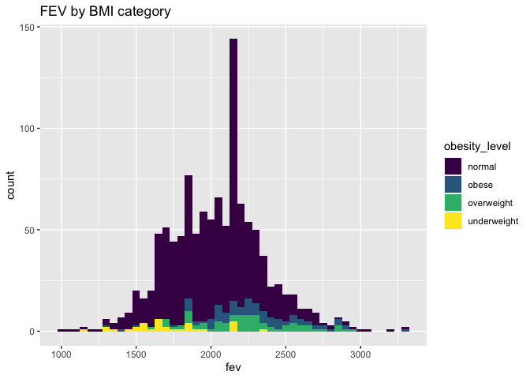
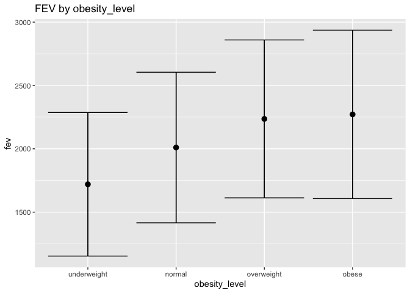
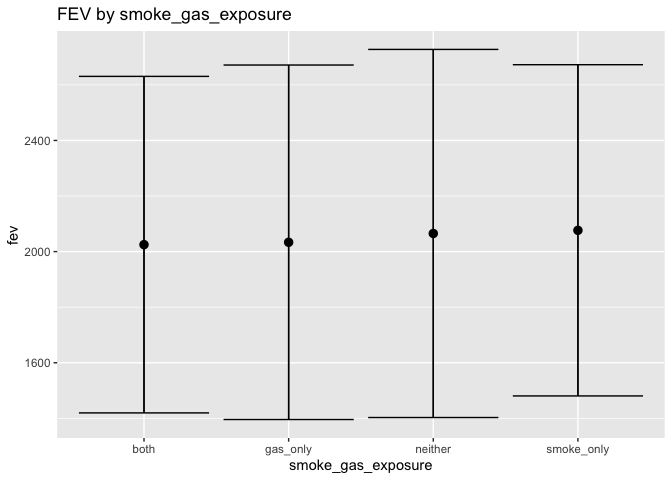

566-hw2
================
Yumeng Gao
2022-10-07

### Prepare the library

``` r
library(dplyr)
```

    ## 
    ## Attaching package: 'dplyr'

    ## The following objects are masked from 'package:stats':
    ## 
    ##     filter, lag

    ## The following objects are masked from 'package:base':
    ## 
    ##     intersect, setdiff, setequal, union

``` r
library(tidyverse)
```

    ## ── Attaching packages
    ## ───────────────────────────────────────
    ## tidyverse 1.3.2 ──

    ## ✔ ggplot2 3.3.6     ✔ purrr   0.3.4
    ## ✔ tibble  3.1.8     ✔ stringr 1.4.1
    ## ✔ tidyr   1.2.0     ✔ forcats 0.5.2
    ## ✔ readr   2.1.2     
    ## ── Conflicts ────────────────────────────────────────── tidyverse_conflicts() ──
    ## ✖ dplyr::filter() masks stats::filter()
    ## ✖ dplyr::lag()    masks stats::lag()

``` r
library(data.table)
```

    ## 
    ## Attaching package: 'data.table'
    ## 
    ## The following object is masked from 'package:purrr':
    ## 
    ##     transpose
    ## 
    ## The following objects are masked from 'package:dplyr':
    ## 
    ##     between, first, last

``` r
library(R.utils)
```

    ## Loading required package: R.oo
    ## Loading required package: R.methodsS3
    ## R.methodsS3 v1.8.2 (2022-06-13 22:00:14 UTC) successfully loaded. See ?R.methodsS3 for help.
    ## R.oo v1.25.0 (2022-06-12 02:20:02 UTC) successfully loaded. See ?R.oo for help.
    ## 
    ## Attaching package: 'R.oo'
    ## 
    ## The following object is masked from 'package:R.methodsS3':
    ## 
    ##     throw
    ## 
    ## The following objects are masked from 'package:methods':
    ## 
    ##     getClasses, getMethods
    ## 
    ## The following objects are masked from 'package:base':
    ## 
    ##     attach, detach, load, save
    ## 
    ## R.utils v2.12.0 (2022-06-28 03:20:05 UTC) successfully loaded. See ?R.utils for help.
    ## 
    ## Attaching package: 'R.utils'
    ## 
    ## The following object is masked from 'package:tidyr':
    ## 
    ##     extract
    ## 
    ## The following object is masked from 'package:utils':
    ## 
    ##     timestamp
    ## 
    ## The following objects are masked from 'package:base':
    ## 
    ##     cat, commandArgs, getOption, isOpen, nullfile, parse, warnings

``` r
library(lubridate)
```

    ## 
    ## Attaching package: 'lubridate'
    ## 
    ## The following objects are masked from 'package:data.table':
    ## 
    ##     hour, isoweek, mday, minute, month, quarter, second, wday, week,
    ##     yday, year
    ## 
    ## The following objects are masked from 'package:base':
    ## 
    ##     date, intersect, setdiff, union

``` r
library(leaflet)
library(webshot)
library(cowplot)
```

    ## 
    ## Attaching package: 'cowplot'
    ## 
    ## The following object is masked from 'package:lubridate':
    ## 
    ##     stamp

# Data Wrangling

### Download and read in csv.

``` r
if (!file.exists("individual.csv")) {
  download.file(
    url = "https://raw.githubusercontent.com/USCbiostats/data-science-data/master/01_chs/chs_individual.csv", "individual.csv", method = "libcurl", timeout  = 60)
}
ind= data.table::fread("individual.csv")

if (!file.exists("regional.csv")) {
  download.file(
    url = "https://raw.githubusercontent.com/USCbiostats/data-science-data/master/01_chs/chs_regional.csv", "regional.csv", method = "libcurl", timeout  = 60)
}
reg= data.table::fread("regional.csv")
```

### Merge the individual and regional CHS datasets using the location variable.

``` r
chs= merge(ind, reg, by= "townname", all=T)
```

## 1.After merging the data, make sure you don’t have any duplicates by counting the number of rows. Make sure it matches.

``` r
str(chs)
```

    ## Classes 'data.table' and 'data.frame':   1200 obs. of  49 variables:
    ##  $ townname     : chr  "Alpine" "Alpine" "Alpine" "Alpine" ...
    ##  $ sid          : int  835 838 839 840 841 842 843 844 847 849 ...
    ##  $ male         : int  0 0 0 0 1 1 1 1 1 1 ...
    ##  $ race         : chr  "W" "O" "M" "W" ...
    ##  $ hispanic     : int  0 1 1 0 1 1 0 1 0 0 ...
    ##  $ agepft       : num  10.1 9.49 10.05 9.97 10.55 ...
    ##  $ height       : int  143 133 142 146 150 139 149 143 137 147 ...
    ##  $ weight       : int  69 62 86 78 78 65 98 65 69 112 ...
    ##  $ bmi          : num  15.3 15.9 19.4 16.6 15.8 ...
    ##  $ asthma       : int  0 0 0 0 0 0 0 NA 0 0 ...
    ##  $ active_asthma: int  0 0 0 0 0 0 0 0 0 0 ...
    ##  $ father_asthma: int  0 0 0 0 0 0 0 NA 0 1 ...
    ##  $ mother_asthma: int  0 0 1 0 0 0 0 NA 0 0 ...
    ##  $ wheeze       : int  0 0 1 0 0 1 1 NA 0 1 ...
    ##  $ hayfever     : int  0 0 1 0 0 0 0 NA 0 0 ...
    ##  $ allergy      : int  1 0 1 0 0 0 1 NA 0 1 ...
    ##  $ educ_parent  : int  3 4 3 NA 5 1 3 NA 5 3 ...
    ##  $ smoke        : int  0 NA 1 NA 0 1 0 NA 0 0 ...
    ##  $ pets         : int  1 1 1 0 1 1 1 0 1 1 ...
    ##  $ gasstove     : int  0 0 0 NA 0 0 1 NA 1 0 ...
    ##  $ fev          : num  2529 1738 2122 2467 2252 ...
    ##  $ fvc          : num  2826 1964 2327 2638 2595 ...
    ##  $ mmef         : num  3407 2133 2835 3466 2445 ...
    ##  $ pm25_mass    : num  8.74 8.74 8.74 8.74 8.74 8.74 8.74 8.74 8.74 8.74 ...
    ##  $ pm25_so4     : num  1.73 1.73 1.73 1.73 1.73 1.73 1.73 1.73 1.73 1.73 ...
    ##  $ pm25_no3     : num  1.59 1.59 1.59 1.59 1.59 1.59 1.59 1.59 1.59 1.59 ...
    ##  $ pm25_nh4     : num  0.88 0.88 0.88 0.88 0.88 0.88 0.88 0.88 0.88 0.88 ...
    ##  $ pm25_oc      : num  2.54 2.54 2.54 2.54 2.54 2.54 2.54 2.54 2.54 2.54 ...
    ##  $ pm25_ec      : num  0.48 0.48 0.48 0.48 0.48 0.48 0.48 0.48 0.48 0.48 ...
    ##  $ pm25_om      : num  3.04 3.04 3.04 3.04 3.04 3.04 3.04 3.04 3.04 3.04 ...
    ##  $ pm10_oc      : num  3.25 3.25 3.25 3.25 3.25 3.25 3.25 3.25 3.25 3.25 ...
    ##  $ pm10_ec      : num  0.49 0.49 0.49 0.49 0.49 0.49 0.49 0.49 0.49 0.49 ...
    ##  $ pm10_tc      : num  3.75 3.75 3.75 3.75 3.75 3.75 3.75 3.75 3.75 3.75 ...
    ##  $ formic       : num  1.03 1.03 1.03 1.03 1.03 1.03 1.03 1.03 1.03 1.03 ...
    ##  $ acetic       : num  2.49 2.49 2.49 2.49 2.49 2.49 2.49 2.49 2.49 2.49 ...
    ##  $ hcl          : num  0.41 0.41 0.41 0.41 0.41 0.41 0.41 0.41 0.41 0.41 ...
    ##  $ hno3         : num  1.98 1.98 1.98 1.98 1.98 1.98 1.98 1.98 1.98 1.98 ...
    ##  $ o3_max       : num  65.8 65.8 65.8 65.8 65.8 ...
    ##  $ o3106        : num  55 55 55 55 55 ...
    ##  $ o3_24        : num  41.2 41.2 41.2 41.2 41.2 ...
    ##  $ no2          : num  12.2 12.2 12.2 12.2 12.2 ...
    ##  $ pm10         : num  24.7 24.7 24.7 24.7 24.7 ...
    ##  $ no_24hr      : num  2.48 2.48 2.48 2.48 2.48 2.48 2.48 2.48 2.48 2.48 ...
    ##  $ pm2_5_fr     : num  10.3 10.3 10.3 10.3 10.3 ...
    ##  $ iacid        : num  2.39 2.39 2.39 2.39 2.39 2.39 2.39 2.39 2.39 2.39 ...
    ##  $ oacid        : num  3.52 3.52 3.52 3.52 3.52 3.52 3.52 3.52 3.52 3.52 ...
    ##  $ total_acids  : num  5.5 5.5 5.5 5.5 5.5 5.5 5.5 5.5 5.5 5.5 ...
    ##  $ lon          : num  -117 -117 -117 -117 -117 ...
    ##  $ lat          : num  32.8 32.8 32.8 32.8 32.8 ...
    ##  - attr(*, ".internal.selfref")=<externalptr> 
    ##  - attr(*, "sorted")= chr "townname"

``` r
nrow(chs)
```

    ## [1] 1200

``` r
nrow(ind)
```

    ## [1] 1200

``` r
nrow(chs)== nrow(ind)
```

    ## [1] TRUE

Since the combined dataset and individual dataset had the same number of
rows, there was no duplicate.

### Check for weird or missing values of key variables.

``` r
#numeric
summary(chs$bmi)
```

    ##    Min. 1st Qu.  Median    Mean 3rd Qu.    Max.    NA's 
    ##   11.30   15.78   17.48   18.50   20.35   41.27      89

``` r
summary(chs$fev)
```

    ##    Min. 1st Qu.  Median    Mean 3rd Qu.    Max.    NA's 
    ##   984.8  1809.0  2022.7  2031.3  2249.7  3323.7      95

``` r
summary(chs$pm25_mass)
```

    ##    Min. 1st Qu.  Median    Mean 3rd Qu.    Max. 
    ##   5.960   7.615  10.545  14.362  20.988  29.970

``` r
#categorical
sum(is.na(chs$smoke))
```

    ## [1] 40

``` r
sum(is.na(chs$gasstove))
```

    ## [1] 33

``` r
sum(is.na(chs$asthma))
```

    ## [1] 31

``` r
sum(is.na(chs$townname))
```

    ## [1] 0

``` r
sum(is.na(chs$male))
```

    ## [1] 0

For numeric variables, there were no weird values. BMI(89) and FEV(95)
had missing values. For categorical variables, smoke(40), gasstove(33),
and asthma(31) had missing values, but as they were all binary, we
cannot assign any “average” to them.

Proportions of NA:

``` r
mean(is.na(chs$bmi))
```

    ## [1] 0.07416667

``` r
mean(is.na(chs$fev))
```

    ## [1] 0.07916667

``` r
mean(is.na(chs$smoke))
```

    ## [1] 0.03333333

``` r
mean(is.na(chs$gasstove))
```

    ## [1] 0.0275

``` r
mean(is.na(chs$asthma))
```

    ## [1] 0.02583333

Since all the missing values of categorical variables took only about 3%
of the whole, we can drop them for further analysis needs:

``` r
chs= chs[!is.na(smoke) & !is.na(gasstove) & !is.na(asthma)]
```

Noted that there were 78 observations dropped from the dataset to
eliminate missing values of categorical variables.

### So for BMI and FEV’s missing data, impute data using the average within the variables “male” and “hispanic”.

``` r
sum(is.na(chs$bmi))
```

    ## [1] 79

``` r
sum(is.na(chs$fev))
```

    ## [1] 85

``` r
bmi_m= mean(chs[male=="1" & hispanic=="1", bmi], na.rm=T)
fev_m= mean(chs[male=="1" & hispanic=="1", fev], na.rm=T)

chs$bmi[is.na(chs$bmi)]= bmi_m
chs$fev[is.na(chs$fev)]= fev_m
```

After data cleaning, 79 missing values of BMI and 85 missing values of
FEV were also replaced with the corresponding average values.

## 2.Create a new categorical variable named “obesity_level” using the BMI measurement (underweight BMI\<14; normal BMI 14-22; overweight BMI 22-24; obese BMI\>24).

``` r
chs[, obesity_level := fifelse(
  bmi < 14, "underweight", 
  fifelse(bmi < 22, "normal", 
  fifelse(bmi < 24, "overweight", "obese")))
  ]
```

### To make sure the variable is rightly coded, create a summary table that contains the minimum BMI, maximum BMI, and the total number of observations per category.

``` r
summary(chs$bmi)
```

    ##    Min. 1st Qu.  Median    Mean 3rd Qu.    Max. 
    ##   11.30   15.92   17.71   18.52   19.94   41.27

``` r
table(chs$obesity_level)
```

    ## 
    ##      normal       obese  overweight underweight 
    ##         912          94          82          34

Summary table:

``` r
obe= chs[, .(
  BMI_Min= min(bmi),
  `# of Underweight (<14)`= 34,
  `# of Normal (14-22)`= 912,
  `# of Overweight (22-24)`= 82,
  `# of Obese (>24)`= 94,
  BMI_Max= max(bmi)
  )]
knitr::kable(obe)
```

| BMI_Min | \# of Underweight (\<14) | \# of Normal (14-22) | \# of Overweight (22-24) | \# of Obese (\>24) |  BMI_Max |
|--------:|-------------------------:|---------------------:|-------------------------:|-------------------:|---------:|
| 11.2964 |                       34 |                  912 |                       82 |                 94 | 41.26613 |

From the table, we can find that most children in this study had normal
BMI level, yet the number of overweight and obese is also alarming.

## 3.Create another categorical variable named “smoke_gas_exposure” that summarizes “Second Hand Smoke” and “Gas Stove.” The variable should have four categories in total.

``` r
chs[, smoke_gas_exposure := fifelse(smoke == 1 & gasstove==1, "both",
                fifelse(smoke==1 & gasstove== 0, "smoke_only",
                fifelse(smoke==0 & gasstove ==1, "gas_only", "neither")))
    ]
table(chs$smoke_gas_exposure)
```

    ## 
    ##       both   gas_only    neither smoke_only 
    ##        146        731        210         35

## 4.Create four summary tables showing the average (or proportion, if binary) and sd of “Forced expiratory volume in 1 second (ml)” and asthma indicator by town, sex, obesity level, and “smoke_gas_exposure.”

### Townname table:

``` r
to= chs[, .(
  N= .N,    
`Average FEV1`= mean(fev),  
`SD FEV1`= sd(fev),     
`%Asthma`= 100* sum(asthma==1)/sum(asthma==1 | asthma==0)
  ), by= townname]

knitr::kable(to)
```

| townname      |   N | Average FEV1 |  SD FEV1 |  %Asthma |
|:--------------|----:|-------------:|---------:|---------:|
| Alpine        |  91 |     2083.947 | 283.5611 | 12.08791 |
| Atascadero    |  94 |     2074.841 | 325.1329 | 25.53191 |
| Lake Elsinore |  90 |     2041.311 | 308.7082 | 13.33333 |
| Lake Gregory  |  97 |     2100.609 | 318.3725 | 15.46392 |
| Lancaster     |  92 |     2030.623 | 308.8579 | 15.21739 |
| Lompoc        |  95 |     2047.279 | 352.1169 | 11.57895 |
| Long Beach    |  91 |     1996.517 | 321.7598 | 13.18681 |
| Mira Loma     |  92 |     2006.531 | 328.7296 | 15.21739 |
| Riverside     |  94 |     1998.685 | 280.4443 | 10.63830 |
| San Dimas     |  97 |     2029.803 | 318.3693 | 16.49485 |
| Santa Maria   |  91 |     2030.422 | 322.1983 | 14.28571 |
| Upland        |  98 |     2034.059 | 343.5017 | 12.24490 |

Among different towns, there was little difference of sample size,
average FEV1 status. For proportion of asthma, Atascadero had the
highest %asthma (25.53%) and Riverside had the lowest %asthma (10.64%),
requiring further analysis.

### Sex(male) table:

``` r
se= chs[, .(
  N= .N,    
`Average FEV1`= mean(fev),  
`SD FEV1`= sd(fev),     
`%Asthma`= 100* sum(asthma==1)/sum(asthma==1 | asthma==0)
  ), by= male]

knitr::kable(se)
```

| male |   N | Average FEV1 |  SD FEV1 |  %Asthma |
|-----:|----:|-------------:|---------:|---------:|
|    0 | 572 |     1972.404 | 312.8069 | 11.88811 |
|    1 | 550 |     2109.822 | 309.3886 | 17.45455 |

This table showed that female kids had lower average FEV1 than male
kids(1792.40 ml vs. 2109.82 ml), and also lower asthma proportion
(11.89% vs. 17.45%).

### Obesity_level table:

``` r
ob= chs[, .(
  N= .N,    
`Average FEV1`= mean(fev),  
`SD FEV1`= sd(fev),     
`%Asthma`= 100* sum(asthma==1)/sum(asthma==1 | asthma==0)
  ), by= obesity_level]

knitr::kable(ob)
```

| obesity_level |   N | Average FEV1 |  SD FEV1 |   %Asthma |
|:--------------|----:|-------------:|---------:|----------:|
| normal        | 912 |     2010.148 | 297.1568 | 13.815789 |
| overweight    |  82 |     2235.991 | 311.5836 | 17.073171 |
| obese         |  94 |     2271.598 | 332.3952 | 22.340425 |
| underweight   |  34 |     1720.027 | 283.3457 |  8.823529 |

For obesity level, the average FEV1 and %asthma both had a increasing
trend as the obesity level increases, underweight children had the
lowest average FEV1 (1720.03 ml) and %asthma (8.82%), while obese
children had the highest average FEV1 (2271.60 ml) and %asthma (22.34%).

### Smoke_gas_exposure table:

``` r
sge= chs[, .(
  N= .N,    
`Average FEV1`= mean(fev),  
`SD FEV1`= sd(fev),     
`%Asthma`= 100* sum(asthma==1)/sum(asthma==1 | asthma==0)
  ), by= smoke_gas_exposure]

knitr::kable(sge)
```

| smoke_gas_exposure |   N | Average FEV1 |  SD FEV1 |  %Asthma |
|:-------------------|----:|-------------:|---------:|---------:|
| neither            | 210 |     2065.263 | 331.1657 | 14.76190 |
| smoke_only         |  35 |     2076.610 | 297.9902 | 17.14286 |
| gas_only           | 731 |     2033.615 | 318.9099 | 14.77428 |
| both               | 146 |     2025.058 | 302.7463 | 13.01370 |

Considering the smoke_gas_exposure level, there was no obvious
difference of the average FEV1, yet the smoke_only group had the highest
%asthma (17.14%) and the both group had the lowest (13.01%). Gas_only
group and neither group had similar asthma proportion (14.77%
vs. 14.76%), indicating that maybe gas stove had little influence on
FEV1 and asthma. However, the limited sample size would also affect the
accuracy of the results.

# Looking at the Data (EDA)

### EDA checklist

> The primary questions of interest are: 1. What is the association
> between BMI and FEV (forced expiratory volume)? 2. What is the
> association between smoke and gas exposure and FEV? 3. What is the
> association between PM2.5 exposure and FEV?

> Check the dimensions, headers and footers

``` r
dim(chs)
```

    ## [1] 1122   51

``` r
head(chs)
```

    ##    townname sid male race hispanic    agepft height weight      bmi asthma
    ## 1:   Alpine 835    0    W        0 10.099932    143     69 15.33749      0
    ## 2:   Alpine 839    0    M        1 10.053388    142     86 19.38649      0
    ## 3:   Alpine 841    1    W        1 10.548939    150     78 15.75758      0
    ## 4:   Alpine 842    1    M        1  9.489391    139     65 15.29189      0
    ## 5:   Alpine 843    1    W        0  9.571526    149     98 20.06462      0
    ## 6:   Alpine 847    1    M        0  9.902806    137     69 16.71034      0
    ##    active_asthma father_asthma mother_asthma wheeze hayfever allergy
    ## 1:             0             0             0      0        0       1
    ## 2:             0             0             1      1        1       1
    ## 3:             0             0             0      0        0       0
    ## 4:             0             0             0      1        0       0
    ## 5:             0             0             0      1        0       1
    ## 6:             0             0             0      0        0       0
    ##    educ_parent smoke pets gasstove      fev      fvc     mmef pm25_mass
    ## 1:           3     0    1        0 2529.276 2826.316 3406.579      8.74
    ## 2:           3     1    1        0 2121.711 2326.974 2835.197      8.74
    ## 3:           5     0    1        0 2251.505 2594.649 2445.151      8.74
    ## 4:           1     1    1        0 2188.716 2423.934 2524.599      8.74
    ## 5:           3     0    1        1 2442.157 3068.627 2158.824      8.74
    ## 6:           5     0    1        1 2142.869 2461.808 2410.977      8.74
    ##    pm25_so4 pm25_no3 pm25_nh4 pm25_oc pm25_ec pm25_om pm10_oc pm10_ec pm10_tc
    ## 1:     1.73     1.59     0.88    2.54    0.48    3.04    3.25    0.49    3.75
    ## 2:     1.73     1.59     0.88    2.54    0.48    3.04    3.25    0.49    3.75
    ## 3:     1.73     1.59     0.88    2.54    0.48    3.04    3.25    0.49    3.75
    ## 4:     1.73     1.59     0.88    2.54    0.48    3.04    3.25    0.49    3.75
    ## 5:     1.73     1.59     0.88    2.54    0.48    3.04    3.25    0.49    3.75
    ## 6:     1.73     1.59     0.88    2.54    0.48    3.04    3.25    0.49    3.75
    ##    formic acetic  hcl hno3 o3_max o3106 o3_24   no2  pm10 no_24hr pm2_5_fr
    ## 1:   1.03   2.49 0.41 1.98  65.82 55.05 41.23 12.18 24.73    2.48    10.28
    ## 2:   1.03   2.49 0.41 1.98  65.82 55.05 41.23 12.18 24.73    2.48    10.28
    ## 3:   1.03   2.49 0.41 1.98  65.82 55.05 41.23 12.18 24.73    2.48    10.28
    ## 4:   1.03   2.49 0.41 1.98  65.82 55.05 41.23 12.18 24.73    2.48    10.28
    ## 5:   1.03   2.49 0.41 1.98  65.82 55.05 41.23 12.18 24.73    2.48    10.28
    ## 6:   1.03   2.49 0.41 1.98  65.82 55.05 41.23 12.18 24.73    2.48    10.28
    ##    iacid oacid total_acids       lon      lat obesity_level smoke_gas_exposure
    ## 1:  2.39  3.52         5.5 -116.7664 32.83505        normal            neither
    ## 2:  2.39  3.52         5.5 -116.7664 32.83505        normal         smoke_only
    ## 3:  2.39  3.52         5.5 -116.7664 32.83505        normal            neither
    ## 4:  2.39  3.52         5.5 -116.7664 32.83505        normal         smoke_only
    ## 5:  2.39  3.52         5.5 -116.7664 32.83505        normal           gas_only
    ## 6:  2.39  3.52         5.5 -116.7664 32.83505        normal           gas_only

``` r
tail(chs)
```

    ##    townname  sid male race hispanic    agepft height weight      bmi asthma
    ## 1:   Upland 1866    0    O        1  9.806982    139     60 14.11559      0
    ## 2:   Upland 1867    0    M        1  9.618070    140     71 16.46568      0
    ## 3:   Upland 2031    1    W        0  9.798768    135     83 20.70084      0
    ## 4:   Upland 2032    1    W        0  9.549624    137     59 14.28855      0
    ## 5:   Upland 2033    0    M        0 10.121834    130     67 18.02044      0
    ## 6:   Upland 2053    0    W        0        NA     NA     NA 19.36857      0
    ##    active_asthma father_asthma mother_asthma wheeze hayfever allergy
    ## 1:             0            NA             0      0       NA      NA
    ## 2:             0             1             0      0        0       0
    ## 3:             0             0             0      1        0       1
    ## 4:             0             0             1      1        1       1
    ## 5:             1             0             0      1        1       0
    ## 6:             0             0             0      0        0       0
    ##    educ_parent smoke pets gasstove      fev      fvc     mmef pm25_mass
    ## 1:           3     0    1        0 1691.275 1928.859 1890.604     22.46
    ## 2:           3     0    1        0 1733.338 1993.040 2072.643     22.46
    ## 3:           3     0    1        1 2034.177 2505.535 1814.075     22.46
    ## 4:           3     0    1        1 2077.703 2275.338 2706.081     22.46
    ## 5:           3     0    1        1 1929.866 2122.148 2558.054     22.46
    ## 6:           3     0    1        0 2125.668       NA       NA     22.46
    ##    pm25_so4 pm25_no3 pm25_nh4 pm25_oc pm25_ec pm25_om pm10_oc pm10_ec pm10_tc
    ## 1:     2.65     7.75     2.96    6.49    1.19    7.79    8.32    1.22    9.54
    ## 2:     2.65     7.75     2.96    6.49    1.19    7.79    8.32    1.22    9.54
    ## 3:     2.65     7.75     2.96    6.49    1.19    7.79    8.32    1.22    9.54
    ## 4:     2.65     7.75     2.96    6.49    1.19    7.79    8.32    1.22    9.54
    ## 5:     2.65     7.75     2.96    6.49    1.19    7.79    8.32    1.22    9.54
    ## 6:     2.65     7.75     2.96    6.49    1.19    7.79    8.32    1.22    9.54
    ##    formic acetic  hcl hno3 o3_max o3106 o3_24   no2 pm10 no_24hr pm2_5_fr iacid
    ## 1:   2.67   4.73 0.46 4.03  63.83  46.5  22.2 37.97 40.8   18.48    27.73  4.49
    ## 2:   2.67   4.73 0.46 4.03  63.83  46.5  22.2 37.97 40.8   18.48    27.73  4.49
    ## 3:   2.67   4.73 0.46 4.03  63.83  46.5  22.2 37.97 40.8   18.48    27.73  4.49
    ## 4:   2.67   4.73 0.46 4.03  63.83  46.5  22.2 37.97 40.8   18.48    27.73  4.49
    ## 5:   2.67   4.73 0.46 4.03  63.83  46.5  22.2 37.97 40.8   18.48    27.73  4.49
    ## 6:   2.67   4.73 0.46 4.03  63.83  46.5  22.2 37.97 40.8   18.48    27.73  4.49
    ##    oacid total_acids       lon      lat obesity_level smoke_gas_exposure
    ## 1:   7.4       11.43 -117.6484 34.09751        normal            neither
    ## 2:   7.4       11.43 -117.6484 34.09751        normal            neither
    ## 3:   7.4       11.43 -117.6484 34.09751        normal           gas_only
    ## 4:   7.4       11.43 -117.6484 34.09751        normal           gas_only
    ## 5:   7.4       11.43 -117.6484 34.09751        normal           gas_only
    ## 6:   7.4       11.43 -117.6484 34.09751        normal            neither

> Check the variable types (done before)

> Take a closer at the key variables and clean data (done before)

> Validate with an external source? (maybe doble-check with the CHS
> database)

> Conduct some summary statistics & Make exploratory graphs:

## 1.Facet plot showing scatterplots with regression lines of BMI vs FEV by “townname”.

``` r
chs %>% 
  ggplot(mapping = aes(x = bmi, y = fev)) + 
  geom_point(mapping = aes(color = townname)) + 
  geom_smooth(method = lm, mapping = aes(linetype = townname)) +
  ggtitle("BMI vs FEV by Townname") +
  facet_wrap(~ townname, nrow = 3)
```

    ## `geom_smooth()` using formula 'y ~ x'

<!-- -->

Based on these 12 scatterplots of different towns, we can find that
among all the 12 towns, as children’s BMI increases, their FEV
increases, indicating that overweight and obesity may associated with
higher amount of air exhaled during the first second of the FVC
maneuver.

## 2.Stacked histograms of FEV by BMI category and FEV by smoke/gas exposure. Use different color schemes than the ggplot default.

``` r
ggplot(chs) +
   geom_histogram(mapping = aes(x = fev, fill= obesity_level), binwidth = 50) +
   ggtitle("FEV by BMI category") +
   scale_fill_viridis_d()
```

<!-- -->

From this histogram we can also observe that as the obesity level goes
up, the frequency of higher FEV level will increase. The normal level
children had the largest peak and widest spread among 4 groups, but this
might be explained by the largest sample size of normal group.

``` r
ggplot(chs) +
   geom_histogram(mapping = aes(x = fev, fill= smoke_gas_exposure), binwidth = 50) +
   ggtitle("FEV by Smoke_gas_exposure") +
   scale_fill_brewer(palette="Spectral")
```

<!-- -->

The spread of 4 groups were similar and the frequency of higher FEV
level didn’t show obvious difference, too. The both group had the
largest peak of FEV (which is more visible than the table before),
suggesting that maybe children exposed to both second hand smoking and
gas stove would have higher FEV1. Smoke_only group had the lowest peak,
which could be explained by the smallest sample size, so we cannot
conclude that 2nd hand smoking had less effect on FEV1.

## 3.Barchart of BMI by smoke/gas exposure.

Using BMI(continuous) as x made the barchart hard to interpret, so it’s
better to use obesity_level(categorical) instead:

``` r
chs$obesity_level= factor(chs$obesity_level, levels = c("underweight", "normal", "overweight", "obese"))

ggplot(chs) +
   geom_bar(mapping = aes(x = obesity_level, colour = smoke_gas_exposure, fill=smoke_gas_exposure), width= 0.5)+
   ggtitle("Barchart of Obesity_level by Smoke_gas_exposure")
```

<!-- -->

``` r
#dodge version
ggplot(chs) +
   geom_bar(mapping = aes(x = obesity_level, colour = smoke_gas_exposure, fill=smoke_gas_exposure), position = "dodge", width= 0.5)+
   ggtitle("Barchart of Obesity_level by Smoke_gas_exposure")
```

<!-- -->

Among obesity level, all 4 groups’ children had gas_only exposure the
most. Underweight (BMI\<14) children didn’t have smoke_only exposure.
Neither group appeared most frequently in normal weight (BMI: 14-22)
children, indicating that eliminating those two exposures could improve
children’s BMI status.

However, because of the huge difference in sample sizes among exposure
groups, we may need larger study population to make inference about the
relationship between BMI level and Smoke_gas_exposure.

## 4.Statistical summary graphs of FEV by BMI and FEV by smoke/gas exposure category.

``` r
chs %>%
  ggplot(mapping = aes(x = obesity_level, y = fev)) + 
    stat_summary(fun.data = mean_sdl, geom = "pointrange") +
    stat_summary(fun.data = mean_sdl, geom = "errorbar") +
    ggtitle("FEV by obesity_level")
```

<!-- -->

``` r
chs %>%
  ggplot(mapping = aes(x = smoke_gas_exposure, y = fev)) + 
    stat_summary(fun.data = mean_sdl, geom = "pointrange") +
    stat_summary(fun.data = mean_sdl, geom = "errorbar") +
    ggtitle("FEV by smoke_gas_exposure")
```

<!-- -->

From the 1st graph, we could conclude that as the obesity level goes up,
children in this study tended to have higher average FEV.

In the 2nd graph, we could hardly find obvious difference among the four
smoke_gas_exposure groups. The order of smoke_gas_exposure from smallest
average FEV to largest is: both, gas_only, neither, smoke_only. No clear
conclusion can be made based on current results.

## 5.A leaflet map showing the concentrations of PM2.5 mass in each of the CHS communities.

``` r
pal <- colorFactor(
  palette = c('red','blue'),  
  domain = chs$pm25_mass)

leaflet(chs) %>%
  addProviderTiles('OpenStreetMap') %>% 
  addCircles(lat=~lat,lng=~lon, opacity=0.5, fillOpacity=0.25, radius=100, color = ~pal(pm25_mass)) %>%
addLegend('bottomleft', pal=pal, values=chs$pm25_mass,
          title='Concentrations of PM2.5 mass among CHS communities', opacity=1)
```

<!-- -->

In the map, we could find those CHS communities located in the city
(more transportation trails) had higher concentrations of PM2.5 mass,
while those communities near the sea and far from the downtown area
(less transportation trails) had lower concentrations of PM2.5 mass.
Thus, the transportation pollution might somehow account for the
increase of PM2.5 mass.

## 6.Choose a visualization to examine whether PM2.5 mass is associated with FEV.

Scatter plot and the regression line:

``` r
 chs %>%
   ggplot(mapping = aes(x = pm25_mass, y = fev)) +
   geom_point() +
   geom_smooth(method = lm, se = FALSE, col = "blue")
```

    ## `geom_smooth()` using formula 'y ~ x'

<!-- -->

``` r
scatterplot= ggplot(data = chs) + geom_point(mapping = aes(x = pm25_mass, y = fev))
lineplot= ggplot(data = chs) + geom_smooth(mapping = aes(x = pm25_mass, y = fev))
plot_grid (scatterplot, lineplot, labels = "AUTO")
```

    ## `geom_smooth()` using method = 'gam' and formula 'y ~ s(x, bs = "cs")'

<!-- -->

We can conclude that, PM2.5 mass is propably associated with FEV. As
PM2.5 mass concentration increases, children’s FEV will decrease.
